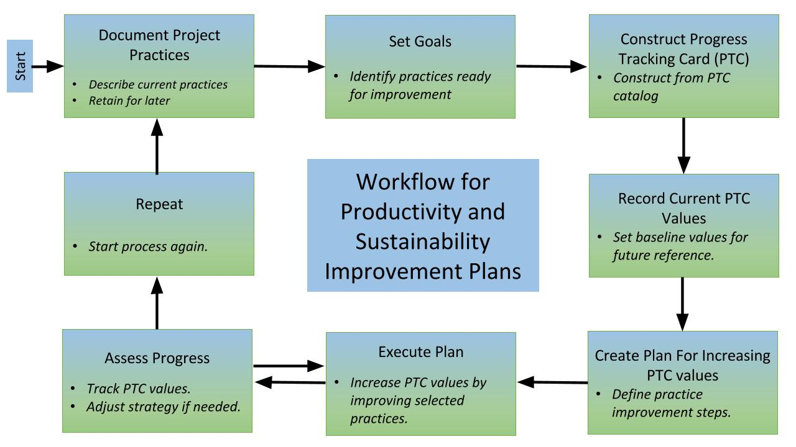

## Productivity and Sustainability Improvement Plan (PSIP) Overview

***A Productivity and Sustainability Improvement Plan (PSIP) is a tool for helping a software team increase software quality while decreasing the effort, time, and cost to develop, deploy, maintain, and extend the software over its intended lifetime.***

### Introduction

A Productivity and Sustainability Improvement Plan (PSIP) is a living document meant as a planning and communication tool for capturing and conveying the practices, processes, policies and tools of a given software project.  It is also, and most importantly, a tool for helping a software team improve **_developer productivity_** (increasing software quality while reducing the effort, time, and cost of development and deployment) and **_software sustainability_**(maintaining and extending a software product over its intended lifespan).  The PSIP workflow is intended to be lightweight and fit in with a project’s standard planning and development process.

### The PSIP Workflow

The development of a PSIP is a multi-step, iterative effort:

1. **Summarize Current Practices:** The first phase is to **briefly** document current project practices.  It is important to record the original state of the project to both provide a baseline for measuring progress and to help identify areas that are ready for improvement.  

2. **Set Goals:** Completing Step 1 will typically bring to light practices that can benefit from a focused improvement effort.  Select goals that you think will best impact the project and are achievable within a predictable span of time (a few weeks to a few months).  Limit the number of goals to a few.  You will have a chance to come back and pick more in the future.

3. **Construct a PTC:** A Progress Tracking Card (PTC) is a document containing the list of practice items you are currently working to improve, with qualitative descriptions and values that help you set and track your progress.  Each practice will have its own PTC item.  You can select PTC items from the PTC catalog; you can also define your own PTC items or modify items you find in the catalog.  The purpose of the PTC is to help your team set and achieve improvement goals.  The PTC is not a tool for external assessment or comparison with other projects.  In fact, because PTC items are custom designed for each project, comparisons will typically not be possible.

4. **Record PTC Values:** In order to establish baseline capabilities and measure progress, you should record the initial values for each item of your PTC.

5. **Create a Practice Improvement Plan:** In order to increase the values of your PTC (corresponding to improvements in software productivity and sustainability), develop a plan to reach a higher value for each PTC item.

6. **Execute the Plan:** Focus team efforts to improve the selected practices.  At first, you may see a slowdown, as your team works to start or improve a given practice.  The slowdown will likely be proportional to the amount of change, but ideally you should see steady progress on a weekly basis after the initial phase, and be able to complete execution of a particular practice improvement within a few months.

7. **Assess Progress:** During execution, assess progress each week.  Adjust your strategy for success if needed.  If progress is delayed too long, go to Step 8 to start the next iteration.

8. **Repeat:**  The PSIP process is iterative.  Continual process improvement is a valuable attribute for any software project.

The remainder of this document provides details for each of these eight steps.

### Step 1: Summarize Current Practices

The initial activity in producing a PSIP is providing a summary of your current practices.  For many scientific software teams, the description of some practices may be very brief, because they are conducted only informally.  This kind of response is fine.  Even so, please address each item listed below.

#### Summarize your project practices:

1. Describe the overall software development process used by the project, emphasizing elements that are most important for productivity and sustainability.  Details should include descriptions of:

    1. How software requirements are determined and transformed into implemented code, tested and deployed (the software lifecycle), 

    2. How integration of new and revised capabilities into the existing software will preserve existing capabilities (regression testing), 

    3. How users will learn about utilizing the code in their scientific efforts (documentation and training).

2. Describe your tools and processes:

    4. Source management tools and processes (how source code will be developed and managed), 

    5. Issue tracking tools and processes (how feature requests and software faults or "bugs" will be recorded and managed), 

    6. Testing tools and processes (how tests will be invoked and reported),

    7. Software distribution tools and processes (how will users and collaborators access software products).

3. Describe training:

    8. How new software developers will be trained,

    9. How the value of the work of departing developers will be retained.

4. Describe improvement strategies:

    10. How you presently improve software productivity and sustainability.

    11. How improvement efforts will be rewarded.

#### Software used but not developed (a.k.a, third-party software):

Use of third-party software typically reduces the cost (time and effort) compared to developing the same capability independently.  At the same time, it also increases risk and complexity.  If the project makes significant use of scientific software developed by others, the following topics should be addressed:

 

1. Describe how the third-party software is tested for correct behavior, initially and when upgrading to a new version (verification and validation).

2. Describe how loss of functionality via faults and missing features is handled by the third-party software.  Describe how complete loss of the third-party capability would be addressed by the application (risk mitigation).

### Step 2: Set Goals

The process of describing your current practices in Step 1 has several benefits.  For some projects, the exercise leads to the first concrete description of these practices.  Furthermore, developing the document leads to discussions among team members, improving understanding and leading to insights about which practices can be improved and how.  Setting PSIP goals comes next for this reason.

When setting productivity and sustainability improvement goals, we are looking for improvements that can be realized in a few weeks or months, at least in early PSIP iterations.  Larger goals are fine, if they can factored into smaller increments with delivered value.  For example, if a project team wants to have a goal of comprehensive testing, the practice improvement plan (Step 5) should specify incremental goals toward the comprehensive goal.

As you set your goals, consider these questions, engaging external expertise:

* What consumes most of our time?

    * Then, where are we inefficient?

        * Then, are there new ways to improve our efficiency?

* Where do we have quality problems?

    * Then, what are the sources of poor quality?

        * Then, how can we improve quality?

* Is our software product sustainable for its expected lifespan?

    * Then, what is limiting sustainability?

        * Then, how can we improve sustainability?

* Can I construct a goal with deliverable value in manageable increments?

    * Can I complete the goal (or a subgoal) in one normal development iteration (a few weeks or months)?

    * Will accomplishing the goal provide tangible payoff within a few months after completion?

After asking these, and similar questions, you will have a list of ideas for how to improve your practices.  Next, you will create a *Progress Tracking Card (PTC)* that will help you establish baseline values and tangibly track progress as your practices improve.

### Step 3: Construct PTC

A Progress Tracking Card (PTC) is a document containing the list of practice items you are currently working to improve, with qualitative descriptions and values that help you set and track your progress.  Each practice will have its own PTC item.  You can select PTC items from the PTC catalog; you can also define your own PTC items or modify items you find in the catalog.  The purpose of the PTC is to help your team set and achieve improvement goals.  The PTC is not a tool for external assessment or comparison with other projects.

To gain insight into defining a progress tracking card, consider the following scenario:

*Your team is planning a significant refactoring of your software base.  As part of the refactoring, you want to introduce unit testing, applying it to the newly refactored code.  Presently you do not have unit testing in place.  A sample PTC for this situation could be as follows.*

<table>
  <tr>
    <td>Practice: Test Coverage </td>
    <td>Score (0 – 5):</td>
  </tr>
  <tr>
    <td>Score Descriptions</td>
    <td></td>
  </tr>
  <tr>
    <td>0</td>
    <td>No unit testing.</td>
  </tr>
  <tr>
    <td>1</td>
    <td>Unit testing implemented for one example refactored class.</td>
  </tr>
  <tr>
    <td>2</td>
    <td>Two developers using unit testing process.</td>
  </tr>
  <tr>
    <td>3</td>
    <td>Unit testing developer documentation completed.</td>
  </tr>
  <tr>
    <td>4</td>
    <td>All developer trained to write unit tests.</td>
  </tr>
  <tr>
    <td>5</td>
    <td>New policy established: All refactored code is covered by unit tests.</td>
  </tr>
</table>

### **Step 4: Record PTC Values** 

In order to establish baseline capabilities and measure progress, you should record the initial values for each item of your PTC.  Often the initial score will be zero.  However, you may have more than one active PTC, so scores can be updated across several PTC in different stages of progress.

### Step 5: Create Practice Improvement Plan

In order to increase the values of your PTC (corresponding to improvements in software productivity and sustainability), develop a plan to reach a higher value for each PTC item.  Associated with each PTC is a plan for improving your score.  The plan will include the steps used to accomplish the next score level.  If your team has an issue tracking process, the practice improvement plan should be brief, listing only task descriptions, since details should be entered into your issue tracking database and tracked there.

Using the unit testing example above, a plan could include these steps for reaching a score of 1:

* Identify example class for refactoring.

* Survey available unit testing frameworks and identify two or three possible candidates.

* Apply candidate frameworks to example class.

* Review the results of the examples using candidate frameworks and select approach for deployment.

If your team has an issue tracking process, the practice improvement plan task should be entered at the level of detail your team practices.

### Step 6: Execute the Plan

Focus team efforts to improve the selected practices.  Ideally you should see progress on a weekly basis and be able to complete execution of a particular practice improvement within a few months.

Except for the practice or practices you are working to improve, executing your plan should be done using your current development process.  In our example, after these steps are complete, your score on the PTC will increase to 1.

### Step 7: Assess Progress

During execution, assess progress each week.  Adjust your strategy for success if needed.  If progress is delayed too long, go to Step 8 to start the next iteration.  Again, you should use your current development process to assess and adjust progress.

### Step 8: Repeat

The PSIP process is iterative.  Continual process improvement is a valuable attribute for any software project.  If your PTC has additional steps to complete, you update your practice improvement plan to include the steps needed to achieve the next score value.  If you were unable to increase your score within the expected development phase, update your practice improvement plan to reflect progress and consider how you can achieve a more accurate prediction of progress.

